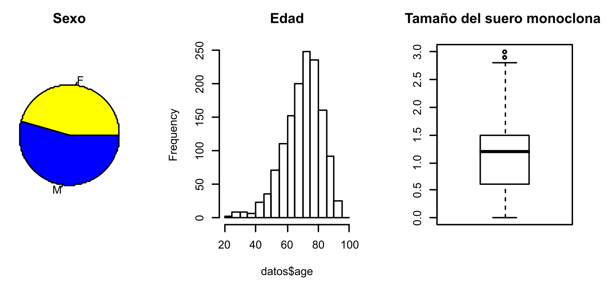
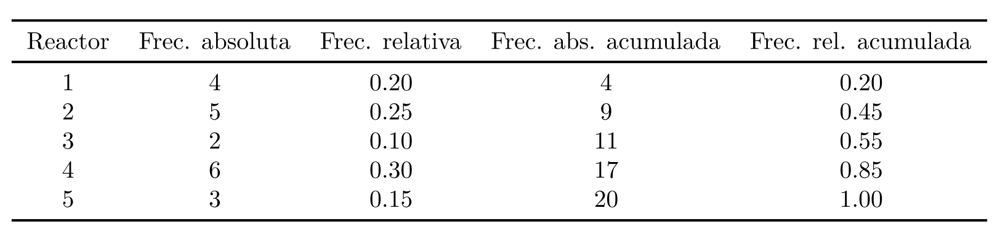
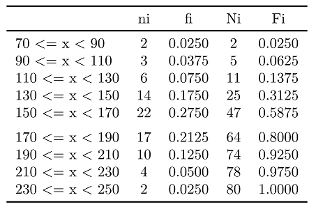
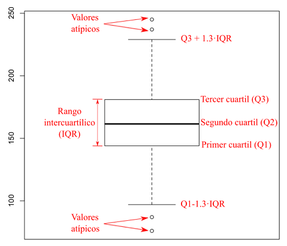

# 1. Introducción y objetivos
Supongamos que se tienen los siguientes datos de 1384 pacientes con Gammapatía Monoclonal de Significado Incierto (MGUS, por sus siglas en inglés): ID del paciente (id), edad (age), sexo (sex), hemoglobina (hgb), creatinina (creat), tamaño del suero monoclonal (mspike), tiempo de progresión a la neoplasia maligna -PCM- (ptime), ocurrencia del PCM (pstat, 0=no, 1=si), tiempo hasta la muerte (futime) y ocurrencia de la muerte (death, 0=no, 1=si). A continuación se muestran los valores de las primeras 20 observaciones.

```{r, echo=FALSE}
df <- read.csv('mgus2.csv')
df$X <- NULL
head(df,n=10)
```



A simple vista, ¿qué información relevante podemos ver en el fichero?, ¿qué podemos concluir?. Es evidente que el primer paso cuando se trabajan con datos es la exploración inicial. Los datos se han de organizar, representar de alguna forma más amena y resumirlos. Por ejemplo, representar gráficamente (como se muestra en la figura) la proporción entre hombres y mujeres, analizar el rango de edad más común con la enfermedad, valor promedio de hemoglobina, etc.

En este taller se hace una introducción a las técnicas básicas para organizar, representar y resumir un conjunto de datos. En la estadística matemática, se conoce como análisis exploratorio de datos o estadística descriptiva. Además, se presentan las diferentes formas de aplicar la estadística descriptiva utilizando R y Rstudio en un conjunto de datos para su mejor interpretación. 

Al finalizar esta sesión, el alumno ha de ser capaz de:

- Identificar las principales maneras de describir, organizar, representar y resumir un conjunto de datos. 
- Construir tablas de frecuencias, representarlas gráficamente, calcular algunos estadísticos importantes (media aritmética, varianza y moda) e interpretar todos estos resultados en R, Rstudio y R-Commander.

# 2. Estadística Descriptiva: teoría y aplicación con R y Rstudio

La estadística descriptiva es la disciplina de la estadística que se encarga de organizar y resumir información cuantitativa para describir las características principales de un conjunto de datos. Frecuentemente, el conjunto de datos incluye diferentes **variables** (por ejemplo: velocidad, resistencia, elasticidad, etc). Por lo tanto, lo más usual es considerar las variables de una en una, sin tener posible relación entre ellas. Según las características de esas variables, se pueden encontrar **variables cualitativas o categóricas** (NO necesitan números para expresarse, por ejemplo: sexo, color, etc) y **variables cuantitativas o numéricas** (SI necesitan números para expresarse, por ejemplo: edad, longitud, etc). Por cada variable hay una serie de observaciones, las anotaciones sobre qué modalidad (cualitativas) o qué valor (cuantitativas) tiene cada observación se denominan **datos**. Estos datos se pueden organizar, resumir y representar mediante:

- ***Tablas**: Matrices donde se guardan los datos que toma una determinada variable para cada objeto. Por ejemplo, tablas de frecuencia.
- **Gráficos**: Representaciones visuales de las tablas que otorgan una visión más general y completa de los datos. Por ejemplo, gráficos de barras, histogramas, gráficos sectoriales y polígonos de frecuencia.
- **Medidas de tendencia central**: Valores que pretenden dar información sobre el centro de la distribución de datos. Algunos ejemplos son la media, la mediana y la moda.
- **Medidas de variabilidad**: Valores que pretenden dar información sobre la homogeneidad de los valores entre sí. Algunos ejemplos son la desviación estándar, la varianza y los cuartiles.

## 2.1 Tabla de frecuencia

El modo más simple de presentar ordenadamente datos categóricos es por medio de una tabla de frecuencias. Esta tabla indica el número de repeticiones de cada una de las clases de la variable cualitativa. Se pueden distinguir los siguientes tipos de frecuencias:
- **Frecuencia absoluta (ni)**: Es el número de repeticiones que presenta una observación. 
- **Frecuencia relativa (fi)**: Es la frecuencia absoluta dividida por el número total de datos. 
- **Frecuencia absoluta acumulada (Ni)**: Es la suma de los distintos valores de la frecuencia absoluta tomando como referencia un individuo dado. La última frecuencia absoluta acumulada es igual al número de casos. 
- **Frecuencia relativa acumulada (Fi)**: Es el resultado de dividir cada frecuencia absoluta acumulada por el número total de datos.

**Ejemplo 1**: El conjunto de datos para el control de calidad del agua de diferentes reactores es el siguiente, donde cada número representa el reactor que se eligió como el mejor: 1, 5, 3, 1, 2, 3, 4, 5, 1, 4, 2, 4, 4, 5, 1, 4, 2, 4, 2, 2

La tabla de frecuencias es:



En *R*, la tabla de frecuencias se puede calcular de la siguiente manera:
```{r}
datos_1 = c(1,5,3,1,2,3,4,5,1,4,2,4,4,5,1,4,2,4,2,2)
ni = table(datos_1) # Frecuencia absoluta 
fi = table(datos_1)/length(datos_1) # Frecuencia relativa 
Ni = cumsum(ni) # Frecuencia absoluta acumulada 
Fi = cumsum(fi) # Frecuencia relativa acumulada 
Tabla_Frec = cbind(ni,fi,Ni,Fi) # Se crea una tabla con todas las frecuencias 
Tabla_Frec # Se visualiza la tabla
```
**Ejemplo 2**: Las resistencias a la compresión de la aleación en libras por pulgada cuadrada (psi) de 80 especímenes de una nueva aleación de aluminio-litio sometida a evaluación como material posible para elementos estructurales de aeronaves son:

105, 221, 183, 186, 121, 181, 180, 143, 167, 141, 97, 154, 153, 174, 120, 168, 176, 110, 158, 133, 245, 228, 174, 199, 181, 158, 156, 123, 229, 146, 163, 131, 154, 115, 160, 208, 158, 169, 148, 158, 207, 180, 190, 193, 194, 133, 150, 135, 118, 149, 134, 178, 76, 167, 184, 135, 218, 157, 101, 171, 165, 172, 199, 151, 142, 163, 145, 171, 160, 175, 149, 87, 160, 237, 196, 201, 200, 176, 150, 170

Cuando los valores de la variable son muchos, conviene agrupar los datos en intervalos o clases para así realizar un mejor análisis e interpretación de ellos. Para construir una tabla de frecuencias con datos agrupados, conociendo los intervalos, se deben determinar la frecuencias correspondientes a cada intervalo.



En *R*, la tabla de frecuencias con datos agrupados se puede calcular de la siguiente manera:

```{r}
datos_2=c(105,221,183,186,121,181,180,143,167,141,97,154,153,174,120,168,176,110,158,133, 245,228,174,199,181,158,156,123,229,146,163,131,154,115,160,208,158,169,148,158, 207,180,190,193,194,133,150,135,118,149,134,178,76,167,184,135,218,157,101,171, 165,172,199,151,142,163,145,171,160,175,149,87,160,237,196,201,200,176,150,170)
breaks = seq(70,250,by=20); breaks # Se crea el vector que contiene los intervalos

```

```{r}
datos_2a = cut(datos_2, breaks, right=FALSE); datos_2a # Asigna c/valor a un intervalo
```
```{r}
ni = table(datos_2a) # Frecuencia absoluta
fi = table(datos_2a)/length(datos_2a) # Frecuencia relativa 
Ni = cumsum(ni) # Frecuencia absoluta acumulada 
Fi = cumsum(fi) # Frecuencia relativa acumulada
Tabla_Frec = cbind(ni,fi,Ni,Fi) # Se crea una tabla con todas las frecuencias 
Tabla_Frec # Se visualiza la tabla
```

***
**Tips**

- `table()` crea resultados tabulares de variables categóricas, o sea, determina la frecuencia absoluta de los datos.
- `cumsum()` calcula un vector cuyos elementos son la suma acumulada del vector de entrada.
- `cbind()` y `rbind()` combinan varios objetos de R en un solo objeto: por columnas y por filas respectivamente.
- `cut()` divide el rango del vector “datos” en los intervalos “breaks” y codifica los valores de los datos de acuerdo al intervalo que pertenecen.

***

## 2.2 Gráficas estadísticas
Las distribuciones de frecuencias se pueden presentar en tablas como las anteriores, o bien en gráficas. La representación gráfica se utiliza para facilitar la comprensión de los resultados, pero no añade ninguna información extra sobre la que contendría una tabla de frecuencias. Sin embargo, ya lo dice el dicho popular “Vale más una imagen que mil palabras”. Existen diversos tipos de gráficas, cada una de ellas adecuada a cierto tipo de variables, a continuación se describen las más usadas y cómo se realizan en R utilizando los dos ejemplos anteriores.

### 2.2.1 Gráfico de tallos y hojas

Es una herramienta que presenta una tabla de datos en un formato gráfico para ayudar a visualizar la forma de la distribución. Es una tabla donde cada dato es dividido según su valor, en un tallo y una hoja. El último dígito del dato representa la hoja, y el resto de dígitos representan el tallo. Este tipo de gráficos otorgan información sobre la localización, dispersión y valores extremos de nuestros datos. El gráfico de tallos y hojas se calcula en R mediante la función `stem()`. La longitud del gráfico se puede modificar utilizando el atributo `scale= `, donde 1 es valor por defecto, 2 produce un gráfico aproximadamente el doble de largo, etc. El gráfico del ejemplo 2 se genera de la siguiente forma:
```{r}
stem(datos_2,scale=1)
```

### 2.2.2 Gráfico de puntos
Cuando se tiene un tabla de frecuencias pequeña de variables categóricas y los valores no distan mucho entre sí, es una atractiva forma de representar los datos obtenidos. En este gráfico el eje horizontal representa los posibles valores de los datos y el eje vertical corresponde a la localización de cada dato dentro de la lista. Cada dato se representa con un punto y se coloca encima del valor que le corresponda y a una altura proporcional al orden que tiene en el conjunto. En ejemplo 1, el primer dato (1) se representa por un punto en la posición (1,1), el segundo dato (5), por un punto en la posición (5,2), el tercero que es 3, en la posición (3,3), el cuarto que es 1, en (1,4) y así respectivamente. El gráfico de puntos se genera con el comando `dotchart()` tal como se muestra a continuación.
```{r}
datos_1
```


```{r}
datos_3 = c('pedro', 'pedro','pedro','pedro','juan','juan','juan', 'maria', 'jose' ) # prueba barplot variables categoricas
barplot(table(datos_3))
```

### 2.2.3 Gráfico de barras
Este gráfico representa visualmente la frecuencia de variables categóricas mediante barras rectangulares de igual anchura. A cada categoría o clase de la variable se le asocia una barra cuya altura representa la frecuencia absoluta o la frecuencia relativa de esa clase. Para generar el gráfico de barras, se utiliza el comando `barplot()`, sin embargo, es necesario definir primero la tabla de frecuencias. Para el ejemplo 1, el gráfico de barras para las frecuencia absoluta es el siguiente:
```{r}
barplot(table(datos_1))
```

### 2.2.4 Histograma
Es la gráfica adecuada para representar variables cuantitativas con un gran número de valores distintos. Los datos se agrupan en intervalos y se representan gráficamente por rectángulos yuxtapuestos cuyas bases descansan sobre el eje horizontal y cuyas alturas son tales que el área de cada rectángulo sea proporcional a la frecuencia de cada intervalo. Si todos los intervalos tienen igual longitud, entonces la altura de cada rectángulo es proporcional a la frecuencia el intervalo. Para evitar confusiones, la principal diferencia con el gráfico de barras es la inexistencia de espacios entre rectángulos. La función `hist()` permite hacer el histograma de unos datos y además modificar la longitud de los intervalos si se desea. A diferencia del gráfico de barras, la función calcula automáticamente la frecuencia del intervalo. El histograma del ejemplo 2 se genera de la siguiente forma:
```{r}
h=hist(datos_2)
```
Si el único argumento de la función es el vector de datos, el histograma se realiza con el número de intervalos (y por lo tanto su longitud) calculados de forma automática. Si el histograma se guarda en un objeto `h = hist()`, éste objeto contiene información como los límites de los intervalos, la frecuencia de cada intervalo, su densidad, el punto medio, etc.
```{r}
h$breaks # Límites de los intervalos
```

```{r}
h$counts # Frecuencia de cada intervalo
```
```{r}
h$density # Densidad de cada intervalo
```
```{r}
h$mids # Punto central de cada intervalo
```
También se puede seleccionar los límites de los intervalos o el número de intervalos en que se quieren agrupar.
```{r}
new_breaks = seq(70,250,by=20) 
h1 = hist(datos_2,breaks=new_breaks)
```

```{r}
h2=hist(datos_2,breaks = 5)
```

### 2.2.5 Gráfico de sectores
Este gráfico se representa como un círculo dividido en porciones, siendo éstas proporcionales a la frecuencia relativa de cada categoría. La función `pie()` permite realizar el gráfico de sectores. Tal como en el gráfico de barras, es necesario definir previamente la tabla de frecuencias. Para el ejemplo 1, el diagrama se realiza de la siguiente forma:
```{r}
pie(table(datos_1))
```

Si se quiere hacer el gráfico de sectores para el ejemplo 2, los datos se tienen que agrupar para poder visualizar información relevante.
```{r}
pie(table(datos_2a))
```

***
Tips

- Las funciones `stem()`, `dotchart()`, `barplot()`, `hist()` y `pie()` permiten resumir visualmente los datos.
- Estos gráficos se pueden mejorar definiendo algunos atributos, como por ejemplo: *col*, *main*, *names.arg*, etc. Utiliza la ayuda para conocer un poco más sobre ellos.

***

## 2.3 Medidas de posición y tendencia central

En ocasiones es conveniente resumir la información de un conjunto de datos numéricos en un solo valor para obtener indicadores del comportamiento de la variable y poder realizar comparaciones. Las medidas de tendencia central, también conocidas como medidas de posición o localización, describen un valor alrededor del cual se encuentran las observaciones.

### Media

También conocida como valor promedio, se define como la suma de todos los valores de cada observación ($x_i$) dividido por el número total de observaciones del conjunto de datos ($N$).

$$ \bar{X} = \frac{x_1+x_2+x_3 + \dots + x_N}{N}= \frac{1}{N} \sum_{i=1}^{N} x_i$$
Si se dispone de un conjunto de datos agrupados en los que se conoce el valor medio de cada intervalo ( $\bar{x_i}$) y el número de datos de cada uno de ellos ($n_i$) , la media está dada por:

$$\bar{X}=\frac{x_1n_1+x_2n_2 + \dots + x_Nn_N}{N}=\sum_{i=1}^{N} x_in_i$$
donde $n_1+n_2+\dots+n_N=N$. Para los ejemplos anteriores, las medias se puede calcular de acuerdo a la definición de la siguiente manera:
```{r}
sum(datos_1)/length(datos_1)
```
```{r}
sum(datos_2)/length(datos_2)
```

Sin embargo, la función `mean()` calcula la media directamente.
```{r}
mean(datos_1)
```
```{r}
mean(datos_2)
```

### 2.3.2 Mediana
La mediana es el dato que ocupa la posición central en la muestra ordenada de menor a mayor, es un punto que divide la muestra ordenada en dos grupos iguales (deja el 50% de los valores por debajo y el otro 50% por encima). Para calcularla se ordenan los datos de menor a mayor, el dato central es el que ocupa la posición $\frac{N+1}{2}$ donde $N$ es el número total de datos. Si $N$ es impar, la mediana es el mismo dato central, si $N$ es par, existen dos datos centrales, por lo tanto la mediana es el promedio de estos dos. Igualmente, existe una función que la calcula directamente: `median()`.
```{r}
median(datos_1)
```
```{r}
median(datos_2)
```

### 2.3.3 Moda
La moda es el valor con mayor frecuencia absoluta en los datos obtenidos, indica cual es el valor más frecuente pero no cuántas veces se repite. Si existen más de dos valores que se repiten con mayor frecuencia, se dice que los datos son multimodales. Se puede calcular la mediante usando las siguientes instrucciones:

```{r}
table(datos_1)
```
```{r}
#Se organiza la tabla de frecuencias de mayor valor (el más frecuente) a menor
freq_ord=sort(table(datos_1),decreasing = TRUE); freq_ord
```

```{r}
# Se toma el valor/es que más se repite/n (el primero de la tabla ordenada) 
moda = names(freq_ord[1]); moda
```
En *R* básico (sin cargar librerías o biblioteca adicionales) no existe una función para calcular la moda, sin embargo, si se instala mediante `install.packages()` y se carga mdiante `library()` la biblioteca ***modes**, se puede calcular mediante la función `modes()`.
```{r}
#install.packages("modes") # Ejecutar solo la primera vez
library(modes)
modes(datos_1)
```
```{r}
modes(datos_2)
```

### 2.3.4 Cuantiles
Los cuantiles son valores de la lista de datos que la dividen en partes iguales, es decir, en intervalos, que comprenden el mismo número de valores. Los más usados son los percentiles, los deciles y los cuartiles. Los percentiles son 99 valores que dividen en cien partes iguales el conjunto de datos ordenados. Por ejemplo, el percentil de orden 15 deja por debajo al 15% de las observaciones, y por encima queda el 85%. Los deciles son los nueve valores que dividen al conjunto de datos ordenados en diez partes iguales, son un caso particular de los percentiles. Los cuartiles son los tres valores que dividen al conjunto de datos ordenados en cuatro partes iguales, son también un caso particular de los percentiles. En R, cualquiera de estos se calcula con la función `quantile()`, donde adicionalmente se ha de especificar el cuantil o cuantiles deseados (como un valor entre 0 y 1) de la siguiente forma:
```{r}
quantile(datos_2,0.95) # Percentil de orden 95
```
```{r}
quantile(datos_2,seq(0.1,0.9,by=0.1)) # Todos los deciles
```
```{r}
quantile(datos_2,seq(0.25,0.75,by=0.25)) # Todos los cuartiles
```
Finalmente, el rango intercuartílico es la extensión cubierta por la mitad central de los datos ordenados, excluyendo la cuarta parte inicial (los que son inferiores al primer cuartil) y la cuarta parte final (los que son superiores al tercer cuartil). La función `IQR()` calcula directamente el rango intercuartílico.
```{r}
quantile(datos_2,0.75) - quantile(datos_2,0.25)
```
```{r}
IQR(datos_2)
```

La media, mediana, mínimo, máximo y cuartiles se pueden calcular directamente mediante la función `summary()`.
```{r}
summary(datos_2)
```

## 2.4 Medidas de variabilidad y dispersión
Las medidas de posición dan una idea de dónde se encuentra el centro de la distribución, pero no nos dicen cuán disperso es el conjunto de datos. Las medidas de dispersión o variabilidad describen que tan cerca se encuentran los datos entre ellos, o de alguna medida de tendencia central.

### 2.4.1 Rango
Es el intervalo entre el valor máximo y el valor mínimo del conjunto de datos. Es altamente sensible a los valores extremos, es decir, es un parámetro estadístico débil. Con la función `range()` también se obtienen el mínimo y el máximo valor del conjunto de datos, por lo tanto, para calcular el rango, solo hace falta calcular su diferencia.
```{r}
max(datos_1)-min(datos_1)
```
```{r}
max(datos_2)-min(datos_2)
```

```{r}
range(datos_1)
```


```{r}
diff(range(datos_1))
```
```{r}
diff(range(datos_2))
```

### 2.4.2 Varianza y desviación estándar
Estas medidas miden cuán lejos difieren los datos de la media. Específicamente, expresan “el promedio de la distancia de cada punto respecto de la media”. La varianza se calcula según:
$$\sigma^2 = \frac{1}{N-1} \sum_{i=1}^{N} (x_i-\bar{X})$$
donde $x_i$ es el valor de cada observación, $\bar{X}$ es la media y $N$ es el número total de datos. Nótese que las unidades de la varianza están expresadas al cuadrado, por lo tanto, si se tienen datos de longitud (en *mm*), la varianza resulta con unidades de superficie (en *mm^2*), lo cual no tiene mucho sentido. Por lo tanto, se dispone de la desviación estándar que no es más que la raíz cuadrada de la varianza, de esta forma, las unidades de la medida de dispersión son las mismas de los datos.
$$\sigma = \sqrt{\sigma^2} = \sqrt{\frac{1}{N-1} \sum_{i=1}^{N} (x_i-\bar{X})}$$
Para el ejemplo 1, la varianza y desviación estándar se puede calcular usando la definición de la siguiente forma:
```{r}
sum((datos_1-mean(datos_1))^2)/(length(datos_1)-1) # Varianza
```
```{r}
sqrt(sum((datos_1-mean(datos_1))^2)/(length(datos_1)-1))# Desviacion estandar
```
En R la varianza y desviación estándar se pueden calcular mediante las funciones `var()` y `sd()` respectivamente.
```{r}
sd(datos_1)
```
```{r}
var(datos_1)
```

## 2.5 Gráfico de caja

Los diagramas de caja son una presentación visual que describe varias características importantes al mismo tiempo, tales como la tendencia central, dispersión y simetría. Para su realización se representan los tres cuartiles y los valores mínimo y máximo de los datos sobre un rectángulo, alineado horizontal o verticalmente. Los valores con dispersión hasta 1.3 (o 1.5) veces el rango intercuartílico se representan como unas líneas rectas o bigotes. Los valores fuera de ese intervalo se representan mediante puntos y se consideran valores extremos atípicos.



`boxplot()` es la función que se utiliza para la creación del gráfico. Tal cual como con el histograma, si se guarda el gráfico de caja en un objeto `h = boxplot()`, éste objeto contiene información como los límites para considerar los valores atípicos, cuáles son esos valores atípicos, los cuartiles, etc.
```{r}
bp=boxplot(datos_2);
bp
```

***
Tips

- Las funciones `mean()`, `median()`, `quantile()`, `IQR()`, `var()`, `sd()` y `boxplot()` permiten nos dan información de tendencia central y variabilidad de los datos.
- Recuerde que puede consultar más información sobre cada función mediante la instrucción `?NombreDeLaFuncion`, por ejemplo `?boxplot`.


***

# EJERCICIOS

### Para los siguientes ejercicios se obtendrá una muestra aleatoria de 40 tiradas de un con dado con la función `sample()`. Se fijará una semilla para que los datos a trabajar sean los mismos al variar el equipo (dependerá también de las especificaciones del computador).

```{r}
set.seed (2016)
(dado <-sample (1: 6, size = 40, replace = TRUE))
```

Para ordenar los valores:
```{r}
sort(dado)
```
1. Para el vector **dado**, calcular la tabla de frecuencias absolutas (con la función `table()`), relativas (dividiendo por la longitud del vector), y relativas acumuladas (con la función `cumsum()`). 

```{r}
# Coloque la solucion aqui

dado_a = cut(dado, breaks = 3 , right = FALSE)


ni = table(dado_a) # frecuencia absoluta
fi = table(dado_a) / length(dado_a) # frecuencia relativa
Ni = cumsum(ni) # frecuencia abosoluta acumulada
Fi = cumsum(fi) # frecuencia relativa acumulada
tabla_frec_ejercicio = cbind(ni, Ni, fi, Fi)
tabla_frec_ejercicio
```

2.  Realice un diagrama de barras de la tabla de frecuencias, un diagrama de sectores, diagrama de caja, y histograma del vector **dado**. Ubique las dos primeras gráficas en la misma figura usando la función `par()` usando el parámetro `mfrow`. Use *chunks* separados para cada gráfica.

```{r}
# Coloque la solucion aqui
par(mfrow = c(1,2))

barp = barplot(ni)
piep = pie(ni)
```


```{r}
boxp = boxplot(dado)
```


```{r}
hist = hist(dado, breaks= 3)
```

3. Calcular la media, mediana, moda (¿Hay varias?), cuartiles, percentiles 25% y 60%, y rango intercuartílico del vector **dado**.

```{r}
# Coloque la solucion aqui

# Ejecutar solo la primera vez
install.packages("modes")
```

```{r}
library(modes)
modes(dado)
```

4. Realice un "resumen" estadístico del vector *dado*.

```{r}
# Coloque la solucion aqui


```

5. Calcular el boxplot correspondiente a las coordenadas del vector v:

```{r,fig.width=5,fig.eight=5}
(v<-c(0,sample(1:6,size=40,replace=TRUE),12,20))

# Coloque la solucion aqui


```

Compruebe que las líneas horizontales del diagrama de cajas coincide con los valores del primer, segundo y tercer cuartil.
```{r}
# Coloque la solucion aqui


```

6. Calcule la varianza del vector **dado** usando la definición (no el comando de R). 

```{r}
# Coloque la solucion aqui


```

7. Compruebe el resultado del punto 6 usando el comando de R.
```{r}
# Coloque la solucion aqui


```

8. Calcule la desviación estándar mediante la definición

```{r}
# Coloque la solucion aqui


```

9. Compruebe el resultado del punto 8 usando el comando de R.

```{r}
# Coloque la solucion aqui


```


11. Los siguientes datos se extrajeron de la revista Motor Trend 1974 de Estados Unidos, resume el consumo y 10 aspectos de diseño y rendimiento de 32 automóviles (modelos 1973-74 ). Este conjunto de datos, que se llama mtcars, contiene 11 variables con 32 observaciones y está almacenado en R . Para poder trabajar con ellos, solo hace falta adjudicarle un nombre al objeto, como por ejemplo:

```{r}
a = mtcars
head(a)
```
Las variables son las siguientes: 

- mpg: Millas por galón de combustible 
- cyl: Número de cilindros 
- disp: Desplazamiento 
- hp: Caballos de potencia 
- drat: Relación del eje trasero 
- wt: Peso (1000 lbs) 
- qsec: Tiempo a 1/4 milla 
- vs: V/S 
- am: Transmisión (0 = automático, 1 = manual) 
- gear: Número de marchas adelante 
- carb: Número de carburadores

Una vez cargado el conjunto de datos proceda a la resolución del cuestionario, añadiendo los *chunks* correspondientes.

- Determine la media, la mediana, la moda y la desviación estándar de cada una de las variables. Se puede calcular a todas la variables? a cuales no? Justifique su respuesta

- Determinar qué variable presenta valores atípicos, ¿cómo los ha encontrado?

- Hacer un gráfico de sectores para cada una de las variables. El gráfico de cuáles variables no cumple con el objetivo de “impactar” o “ser más clara” que la tabla de datos?

- Hacer el histograma para cada una de las variable usando 5 intervalos. De nuevo, está gráfica es útil para todas las variables? justifique su respuesta.

- Realice una gráfica que incluya el diagrama de cajas de todas las variables de tal manera de que se puedan comparar.

12. Reproduzca la figura 1, con el dataset suministrado en el archivo `mgus2.csv`. Use la función `par()`.

